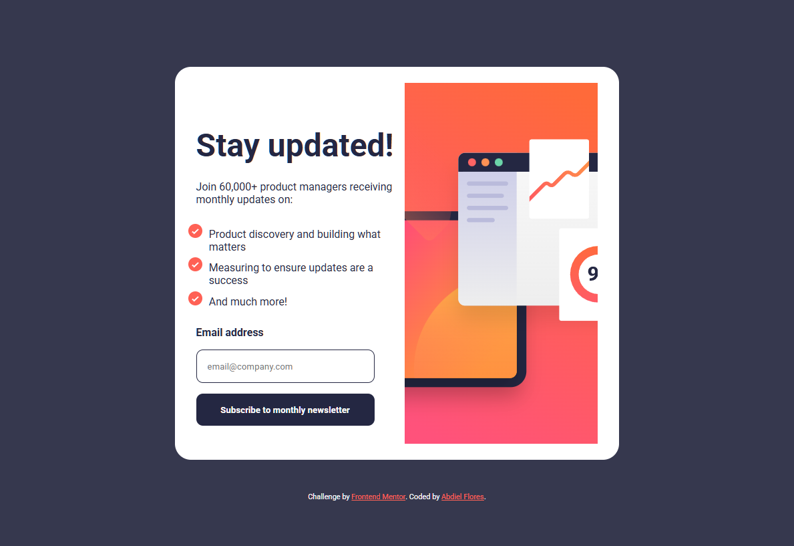

# Frontend Mentor - QR code component solution

This is a solution to the [QR code component challenge on Frontend Mentor](https://www.frontendmentor.io/challenges/qr-code-component-iux_sIO_H). Frontend Mentor challenges help you improve your coding skills by building realistic projects.

## Table of contents

- [Overview](#overview)
  - [Screenshot](#screenshot)
  - [Links](#links)
- [My process](#my-process)
  - [Built with](#built-with)
  - [What I learned](#what-i-learned)
  - [Continued development](#continued-development)
  - [Useful resources](#useful-resources)
- [Author](#author)
- [Acknowledgments](#acknowledgments)

**Note: Delete this note and update the table of contents based on what sections you keep.**

## Overview

### Screenshot

### Links

- Solution URL: [Add solution URL here](https://github.com/fm-challenges-abdiel/newsletter-sign-up)
- Live Site URL: [Add live site URL here](https://fm-challenges-abdiel.github.io/newsletter-sign-up)

## My process

- Structure HTML with semantic tags
- Structure CSS with desktop first approach
- Using flex properties to proportionally expand
- Use media queries to make it responsive
- Use picture element to include all images

### Built with

- HTML5
- CSS3
- Flexbox

### What I learned

This is a special case where we are starting to work with different images, and sicen I started this path of frontend mentor, this is the firstime that I'm challenged to use different images with different stlyes. This knowledge makes me even better at css style.

### Continued development

Even if this challenge was really hard, I think we all that have come here trough the whole path are watching our progress and this makes me feel really comitted to finish all the remain paths.

### Useful resources

- [How to use html picture element](https://stackoverflow.com/questions/74071132/how-to-use-html-picture-element) This resource will help all to know when to switch images with picture element.

## Author

- Website - [Foxcoon.Studio](https://www.foxcoon.studio)
- Frontend Mentor - [@yourusername](https://www.frontendmentor.io/profile/abdiel-code)
